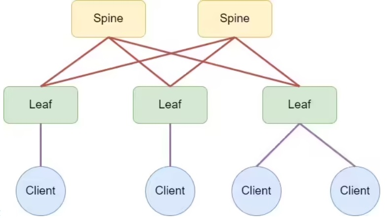
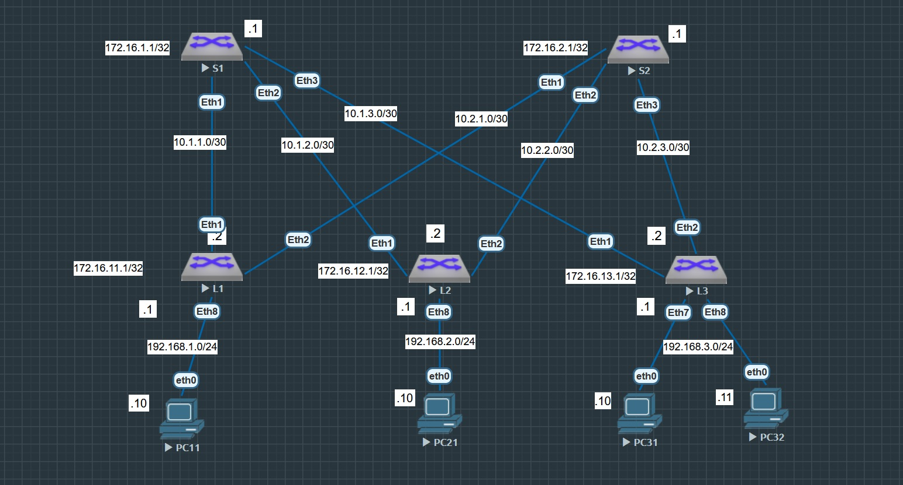
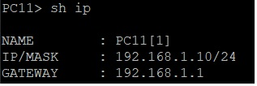
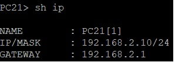
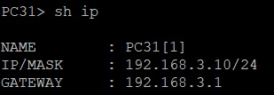
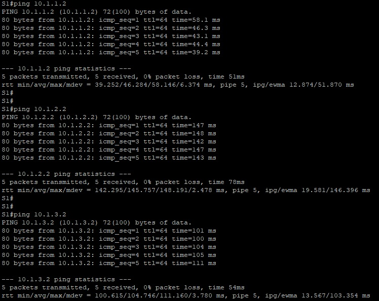
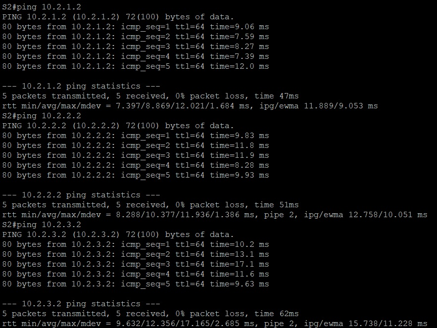
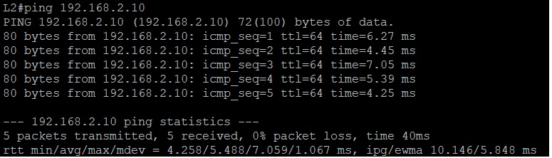
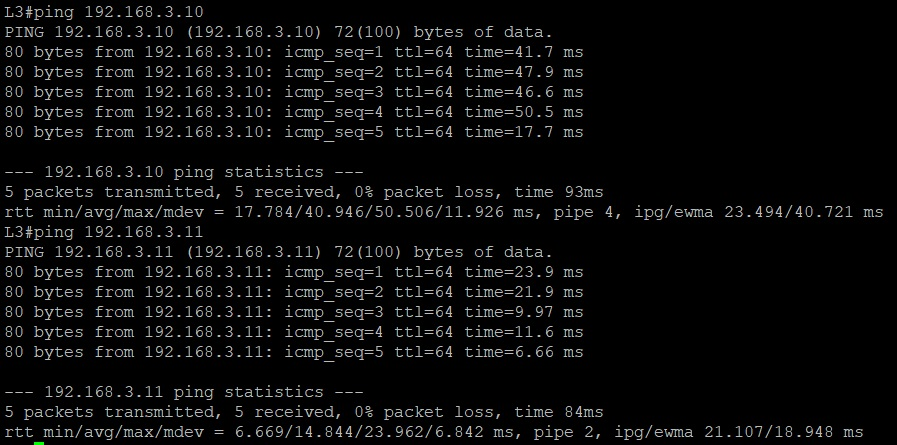

# Лабораторная работа №1. Проектирование адресного пространства

## Цель

Сбор схемы CLOS и распределение адресное пространство.

## Постановка задачи

1. Произвести проектирование и сбор топологии по представленной схеме



2. Распределите адресное пространство в рамках спроектированной Underlay сети

## Описание задачи

В рамках поставленой задачи требуется произвести проектирование тестовой сети в лабораторном окружении Eve-NG, а так же произвести расчет адресного простарнства для данной сети.
Данная задача является подготовительной работой, в которой создается тестовая среда для последующих лабораторных работ.

# Введение

## Термины

- Топология сети — схема соединения сетевого оборудования и других устройств, определяющая их физическое расположение и способ передачи данных
- Адресное пространство сети — совокупность всех возможных уникальных адресов, которые могут быть присвоены устройствам для их идентификации и обмена данными в рамках локальной 
или глобальной сети.
- Underlay-сеть (сеть подложки) — физическая сеть, состоящая из аппаратных устройств, таких как коммутаторы и кабели, которая обеспечивает базовую связность и передачу пакетов
между физическими узлами
- Spine-Leaf (CLOS) архитектура - широко применяемая в рамках высоконагруженных сетей архитекрута сети, состоящая из Leaf устройств, обеспецивающих подключение конечный устройств, и 
Spine устройств, обеспечивающих связность нижестоящих Leaf устройств.

## Оборудование

1. Виртуальный коммутатор окружения Eve-NG на базе операционной системы vEOS версии EOS-4.29.2F
2. Виртуальный хост окружения Eve-NG

## Расчет адресного пространства

Подготовка адресного пространства производилась из расчета трех Leaf и двух Spine устройств. Каждое Leaf устройство должно быть обеспечено уникальными ipv4 адресами, для 
обеспечения связности со всеми Spine устройствами, а так же конечными устройствами. Так же на всех сетевых устройствах должен присутствовать индивидуальный Loopback адрес. 
Конечные устройства к вачестве примера получат подсеть с префиктом 24.

### Таблица адресов сетевых устройств Spine

|N|Device|Port|IP Address|Prefix|
|:-:|:-:|:-:|:-:|:-:|
|1|S1|eth1|10.1.1.1|30|
|2|S1|eth2|10.1.2.1|30|
|3|S1|eth3|10.1.3.1|30|
|4|S2|eth1|10.2.1.1|30|
|5|S2|eth2|10.2.2.1|30|
|6|S2|eth3|10.2.3.1|30|

### Таблица адресов сетевых устройств Leaf

|N|Device|Port|IP Address|Prefix|
|:-:|:-:|:-:|:-:|:-:|
|1|L1|eth1|10.1.1.2|30|
|2|L1|eth2|10.2.1.2|30|
|3|L1|eth8|192.168.1.1|24|
|4|L2|eth1|10.1.2.2|30|
|5|L2|eth2|10.2.2.2|30|
|6|L2|eth8|192.168.2.1|24|
|7|L3|eth1|10.1.3.2|30|
|8|L3|eth2|10.2.3.2|30|
|9|L3|eth8|192.168.3.1|24|

### Таблица Loopback адресов сетевых устройств

|N|Device|Port|IP Address|Prefix|
|:-:|:-:|:-:|:-:|:-:|
|1|S1|Lo0|172.16.1.1|32|
|2|S2|Lo0|172.16.2.1|32|
|3|L1|Lo0|172.16.11.1|32|
|4|L2|Lo0|172.16.12.1|32|
|5|L3|Lo0|172.16.13.1|32|

### Таблица адресов конечных устройств

|N|Device|Port|IP Address|Prefix|
|:-:|:-:|:-:|:-:|:-:|
|1|PC11|eth0|192.168.1.10|24|
|2|PC21|eth0|192.168.2.10|24|
|3|PC31|eth0|192.168.3.10|24|
|4|PC32|eth0|192.168.3.11|24|

### Карта распределения подсетей

1. Spine устройств

10.X.Y.1 

 - X номер spine устройства
 - Y номер leaf усторйства

2. Leaf устройств

10.X.Y.2

 - X номер spine устройства
 - Y номер leaf усторйства

3. Конечных устройств

192.168.Y.Z

 - Y номер leaf усторйства
 - Z Номер конечного устройства

## Подготовка стенда

В рамках лабораторной работы на предоставленном учебным центром лабораторном окружении было распределено пять коммутаторов. Данные коммутаторы были соеденины линиями связи по схеме CLOS,
два из которых (S1 и S2) выступают в качестве Spine устройств, и три (L1,L2 и L3) в качестве Leaf устройств. Схема сети в рамках лабораторного окружения представлена на рисунке ниже



## Настройка устройств

В рамках учебной лабораторной среды все устройства были настроены в соответствии с таблицами адресов

Ниже приведены частичные настройки файлов конфигураций сетевых устройств

#### Spine устройства

**S1**
```
hostname S1
!
interface Ethernet1
   description <leaf L1>
   no switchport
   ip address 10.1.1.1/30
!
interface Ethernet2
   description <leaf L2>
   no switchport
   ip address 10.1.2.1/30
!
interface Ethernet3
   description <leaf L3>
   no switchport
   ip address 10.1.3.1/30
!
interface Loopback0
   ip address 172.16.1.1/32
!
ip routing
```

**S2**
```
hostname S2
!
interface Ethernet1
   description <leaf L1>
   no switchport
   ip address 10.2.1.1/30
!
interface Ethernet2
   description <leaf L2>
   no switchport
   ip address 10.2.2.1/30
!
interface Ethernet3
   description <leaf L3>
   no switchport
   ip address 10.2.3.1/30
!
interface Loopback0
   ip address 172.16.2.1/32
!
ip routing
```

#### Leaf устройства

**L1**
```
hostname L1
!
interface Ethernet1
   description <spine S1>
   no switchport
   ip address 10.1.1.2/30
!
interface Ethernet2
   description <spine S2>
   no switchport
   ip address 10.2.1.2/30
!
interface Ethernet8
   description <PC11>
   no switchport
   ip address 192.168.1.1/24
!
interface Loopback0
   ip address 172.16.11.1/32
!
ip routing
```

**L2**
```
hostname L2
!
interface Ethernet1
   description <spine S1>
   no switchport
   ip address 10.1.2.2/30
!
interface Ethernet2
   description <spine S2>
   no switchport
   ip address 10.2.2.2/30
!
interface Ethernet8
   description <PC21>
   no switchport
   ip address 192.168.2.1/24
!
interface Loopback0
   ip address 172.16.12.1/24
!
ip routing
```

**L3**
```
hostname L3
!
vlan 3
   name users
!
interface Ethernet1
   description <spine S1>
   no switchport
   ip address 10.1.3.2/30
!
interface Ethernet2
   description <spine S2>
   no switchport
   ip address 10.2.3.2/30
!
interface Ethernet7
   description <PC31>
   switchport access vlan 3
!
interface Ethernet8
   description <PC32>
   switchport access vlan 3
!
interface Loopback0
   ip address 172.16.13.1/32
!
interface Vlan3
   description <User`s VLAN>
   ip address 192.168.3.1/24
!
ip routing
```

**PC11**



**PC21**



**PC31**



**PC32**


# Заключение

## Проверка работы сденда и результаты работы

Стенд может считаться рабочим в случае получения ответов на всех Spine устройств от каждого из Leaf устройств. Тесты работы производился посредством отправики ICMP Echo запроса. 

**ICMP отклик на коммутаторе S1 от коммутаторов L1,L2 и L3**



**ICMP отклик на коммутаторе S2 от коммутаторов L1,L2 и L3**



А так же получения ответов со всех Leaf устройств от подключенных к нему конечных устройств.

**ICMP отклик на коммутаторе L1 от конечного устройства PC11**


**ICMP отклик на коммутаторе L2 от конечного устройства PC21**



**ICMP отклик на коммутаторе L3 от конечных устройств PC31 и PC32**



## Вывод

Был подготовлен рабочий стенд, собранный в соответствии с CLOS архитекрурой. Произведены испытания, показавшие наличие IP доступности сетевых уровней Spine-Leaf.